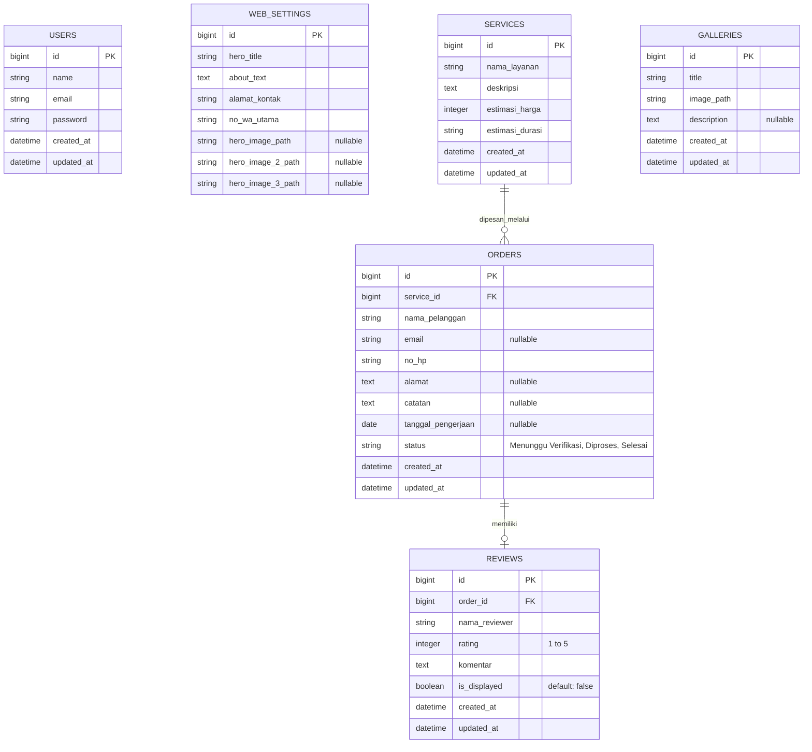

# Dokumentasi Desain Sistem (UML & Database)
*Dokumen ini dirancang khusus untuk bab Perancangan Sistem pada Skripsi/Jurnal IT.*

Di bawah ini terdapat berbagai diagram yang direpresentasikan dalam format **Mermaid**. Asisten Anda dapat menyalin kode (syntax) diagram di bawah ini dan menempelkannya ke situs [Mermaid Live Editor](https://mermaid.live/) untuk menghasilkan gambar grafis beresolusi tinggi (PNG/SVG) yang siap disisipkan ke dalam naskah skripsi.

---

## 1. Use Case Diagram
Diagram ini mendeskripsikan interaksi antara aktor (Pengunjung dan Admin) dengan sistem.

```mermaid
usecaseDiagram
    actor Pengunjung
    actor Admin

    package "Sistem Informasi Jasa Sumur Bor" {
        %% Use Case Pengunjung
        usecase "Melihat Informasi Profil & Layanan" as UC1
        usecase "Melihat Portofolio / Galeri" as UC2
        usecase "Melakukan Pemesanan (Guest Checkout)" as UC3
        usecase "Mengirim Ulasan / Testimoni" as UC4

        %% Use Case Admin
        usecase "Login ke Dashboard" as UC5
        usecase "Kelola Web Settings (Banner, Teks, Kontak)" as UC6
        usecase "Kelola Katalog Layanan (CRUD)" as UC7
        usecase "Kelola Galeri Proyek (CRUD)" as UC8
        usecase "Kelola Pesanan & Jadwal Kerja" as UC9
        usecase "Moderasi Ulasan (Tampil/Sembunyikan)" as UC10
        usecase "Logout" as UC11
    }

    Pengunjung --> UC1
    Pengunjung --> UC2
    Pengunjung --> UC3
    Pengunjung --> UC4

    Admin --> UC5
    Admin --> UC6
    Admin --> UC7
    Admin --> UC8
    Admin --> UC9
    Admin --> UC10
    Admin --> UC11
    
    %% Relationships
    UC9 ..> UC5 : <<include>>
    UC10 ..> UC5 : <<include>>
```

---

## 2. Activity Diagram (Alur Pemesanan & Anti-Spam)
Diagram ini menjelaskan alur spesifik (*workflow*) dari sistem pemesanan baru yang memiliki validasi anti-spam hingga pesanan selesai diproses.

```mermaid
flowchart TD
    %% Aktor Publik
    A[Mulai: Pengunjung Membuka Form Pemesanan] --> B(Mengisi Form: Nama, Email, No HP, Layanan, Alamat)
    B --> C{Submit Pesanan}
    
    %% Sistem Backend
    C -->|Kirim Request| D[Sistem Memeriksa Database Tabel Orders]
    D --> E{Apakah Email atau No HP\nmemiliki status 'Menunggu Verifikasi'?}
    
    E -->|YA (Spam Terdeteksi)| F[Tampilkan Error Validasi di Frontend]
    F --> B
    
    E -->|TIDAK| G[Sistem Menyimpan Data Order\nStatus: Menunggu Verifikasi]
    G --> H[Tampilkan Pesan Sukses ke Pengunjung]
    
    %% Aktor Admin
    H --> I[Admin Login dan Memeriksa Dashboard Pesanan]
    I --> J[Admin Menghubungi Klien via WhatsApp\nuntuk Konfirmasi & Survei]
    J --> K[Admin Memasukkan Tanggal Pengerjaan\n& Mengubah status ke 'Diproses']
    K --> L[Proses Pengeboran di Lapangan Selesai]
    L --> M[Admin Mengubah status ke 'Selesai']
    M --> N([Selesai / Tamat])
```

---

## 3. Entity Relationship Diagram (ERD) / Database Schema
Diagram ini merepresentasikan arsitektur *database* rasional (Relational Database) dari sistem ini.



### Penjelasan Relasi Database untuk Bab 4:
1. **Tabel `services` dengan tabel `orders` (One-to-Many):** 
   Satu jenis layanan (`services`) dapat dipesan berulang kali oleh banyak pelanggan dan menghasilkan banyak data pesanan (`orders`).
2. **Tabel `orders` dengan tabel `reviews` (One-to-One):** 
   Satu data pesanan spesifik (`orders`) hanya boleh memiliki batas maksimal satu ulasan/testimoni (`reviews`). Jika status order bukan 'Selesai', data review tidak dapat diciptakan.
3. Tabel `users`, `galleries`, dan `web_settings` berdiri sendiri (*Independent Entities*) dalam konteks operasional utama, di mana `web_settings` berfungsi sebagai penyimpan konfigurasi sistem Singleton (hanya 1 baris data).
